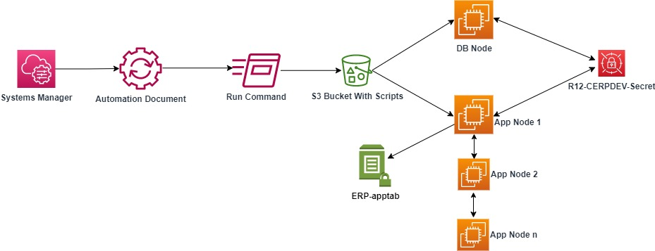
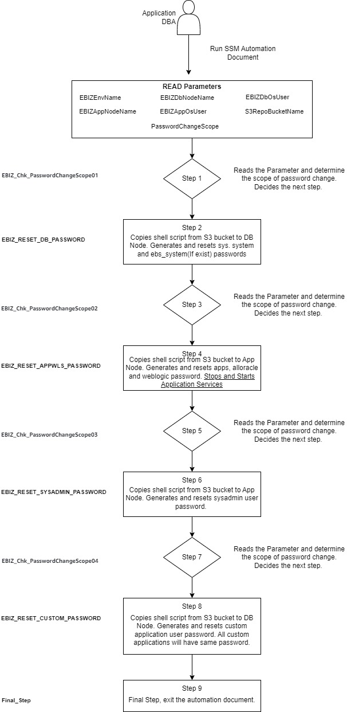

# EBIZ-Password-Reset

| Version | Author | Date | Description |
| ------ | ------ |------|--------------|
| 1.0       | Sridhar Mahadevan | Apr 11 2023 |  Initial Version            |


## Description

Application DBAs take a variety of preventative measures to avoid security vulnerabilities to the Oracle E-Business Suite application. One such critical task is to rotate passwords for administrative users such as sys, system, ebs system, apps, sysadmin, weblogic, and custom application user on a regular basis. Some enterprises have enforced the password rotation exercise by introducing it as part of their organizational security compliance requirements.

The sample code EBIZ_PassWd_Reset_Automation.yml create an AWS Systems Manager (SSM) automation document that will orchestrate the Oracle E-Business suite administrative users password change. The shell scripts in the scripts folder contains the business logic that performs various activities in the password change process.

This sample code is a starting point for customers to understand how to build SSM automation documents that can help benefit the operation of Oracle E-Business Suite on AWS cloud.

## Prerequisites

- An Oracle E-Business suite R12.2.x with Oracle Database 12.x or 19c running on AWS EC2 with Oracle Linux 7 or Red Hat Enterprise Linux (RHEL) version 7.x. The application can be configured as a single or multi-node configuration. 

- Ability to ssh between database and application tiers using the respective operating system user using which database and application is configured. (For Example: oracle operating system user for database and applmgr operating system user for application).

- AWS S3 bucket (For Example: erpopsrepo). This is required to copy the shell scripts along with its folder from this project, the shell script has the core logic to perform various activities as part of the password change process.

- AWS IAM Role with EC2 as use case and with the below AWS Managed IAM Policies attached and a Custom Managed IAM Policy with below policy statements and attached to all AWS EC2 instances in which the Oracle E-Business Suite is configured.


AWS Managed Policies
```
   ReadOnlyAccess
   AmazonSSMManagedInstanceCore
```
Custom Managed Policy Statements with allow Effect
```
    "ssm:PutParameter",
    "s3:PutObject",
    "s3:GetObject",
    "ssm:DescribeParameters",
    "ssm:GetParameter",
    "ssm:SendCommand",
    "ssm:ResumeSession",
    "ec2:DescribeInstances",
    "ssm:GetCommandInvocation",
    "ssm:StartSession",
    "ec2:DescribeAvailabilityZones",
    "ssm:ListCommandInvocations",
    "secretsmanager:GetSecretValue",
    "secretsmanager:PutSecretValue",
    "secretsmanager:UpdateSecret"
```
- SSM Agent is installed in all the AWS EC2 instances and ability to connect to the AWS EC2 instances from cloud console. Guide to install and configure SSM Agent can be found in this link. 

- Create AWS Systems Manager Parameter store as standard tier and as SecureString type with the name ERP-apptab which should store values as colon “:” delimited string in the below format in correct order as mentioned below.

cdbname:pdbname:appnode:App Base Path

Example:
```
CERPDEV:ERPDEV:erpapp01.internal:/fh01/ERPDEV
CERPDEV:ERPDEV:erpapp02.internal:/fh01/ERPDEV
CERPUAT:ERPUAT:erpapp01.internal:/fh01/ERPUAT
CERPUAT:ERPUAT:erpapp02.internal:/fh01/ERPUAT
CERPUAT:ERPUAT:erpapp03.internal:/fh01/ERPUAT
```
In case of database without container database configuration, mention same database SID name for both cdbname and pdbname.

Example:
```
ERPDEV:ERPDEV:erpapp01.internal:/fh01/ERPDEV
ERPDEV:ERPDEV:erpapp02.internal:/fh01/ERPDEV
ERPUAT:ERPUAT:erpapp01.internal:/fh01/ERPUAT
ERPUAT:ERPUAT:erpapp02.internal:/fh01/ERPUAT
ERPUAT:ERPUAT:erpapp03.internal:/fh01/ERPUAT
```
- Create AWS Secrets Manager Secrets of type "Other type of secret" with the naming convention R12-<>CDBNAME<>-Secret which should store username in Secret Key and corresponding password in Secret value as colon “:” delimited string in the below format in correct order. This secret is the password repository and passwords are read and updated in this secret by the automation process.
```
**Secret Key**
system:apps:sysadmin:weblogic:ebs_system:customapps
**Secret Value**
Password of the users in the same order
```
Example: Secret name R12-CERPDEV-Secret
```
**Secret Key**
system:apps:sysadmin:weblogic:ebs_system:customapps
**Secret Value**
system123:apps890:sysadmin123:weblogic345:ebssystem007:custapp003
```
NOTE: The automation process reads the Secrets Manager secret and expects the mentioned naming conventions and string storage pattern and order for successful execution. The automation always assumes the first password is for system and 2nd password is for apps and 3rd password is for sysadmin and 4th password is for weblogic and 5th password is for ebs_system and 6th password is for custom apps. If your environment does not have ebs_system then enter a dummy password. 

- **AWS EC2 instance tagging**. The automation recognizes the database and application servers using AWS EC2 instance tagging. Ensure the AWS EC2 instances have a tag with Key as Name and Value as a unique identifiable name for the AWS EC2 instance.

- /etc/oratab file is populated with correct Oracle Home details of the database so that the database can be sourced using . oraenv ORACLE_SID

## Architecture

The following architecture diagram represents the flow for Oracle E-Business Suite system password change process. The parameter store ERP-apptab is read by the Application nodes to determine the start and stop sequence, autoconfig execution sequence. The parameter store R12-<>CDBNAME<>-secret(Example: R12-CERPDEV-secret) is read to fetch the existing passwords and to update back with new passwords.



The diagram below shows the execution flow of each step of the SSM automation document in the sample code file (EBIZ_PassWd_Reset_Automation.yml)



## Deployment

This repository has yml script to create AWS System Manager Automation document and shell scripts. Kindly follow the below steps to deploy this automation.

Before moving further ensure you have gone configured the Prerequisites as documented in the previous section.

1. Clone the github repository and navigate to the directory.

```
$ git clone https://github.com/aws-samples/automation-oracle-e-business-suite-apps-password-change.git
$ cd automation-oracle-e-business-suite-apps-password-change
```
2. Copy the scripts folder scripts to an AWS S3 bucket in your account that can be accessed by your AWS EC2 instances.

3. Deploy the EBIZ_PassWd_Reset_Automation.yml by copying the content of the yml script into AWS System Manager new document as per the steps given below.
    - [ ] Navigate to AWS System Manager in your AWS console account where E-Business Suite is hosted.
    - [ ] Select Documents under Shared Resources.
    - [ ] Select Create Document and select Automation. This will take you to Create automation page.
    - [ ] Enter EBIZ_PassWd_Reset_Automation as the name for the doucment.
    - [ ] Select Editor and press Edit button under document editor pane.
    - [ ] Paste the content of EBIZ_PassWd_Reset_Automation.yml into the editor into the document editor section.
    - [ ] Press Create automation button at the bottom of the screen. This would create the automation document.


## Automation execution

Once the AWS System Manager Automation Documentation is created along with all its Prerequisites. We should be able to run the automation by executing the below steps.

1. Navigate to AWS System Manager in your AWS console account where this automation is deployed.
2. Select Documents under Shared Resources.
3. Navigate to 'Owned by me' tab.
4. Search and select the EBIZ_PassWd_Reset_Automation document.
5. Proceed to press Execute Automation button and scroll down to input parameters section to enter the input parameters
6. There are 7 input parameters which should be entered with details of target E-Business Suite environment as mentioned below


| Parameter Name | Purpose | Sample Value |
| ------ | ------ |------|
| EBIZEnvName      | Your Oracle E-Business Suite Environment Name for which passwords should be changed | ERPDEV |
| EBIZDbNodeName      | Database node name of your Oracle E-Business suite application | ERPDEVDB01 |
| EBIZDbOsUser      | OS user using which Oracle E-Business suite oracle database is configured| oracle |
| EBIZAppNodeName      | Primary application node of Oracle E-Business Suite | ERPDEVAPP01 |
| EBIZAppOsUser      | OS user using which Oracle E-Business suite application is configured | applmgr |
| PasswordChangeScope      | Scope of password change (DB, Apps/Weblogic, Sysadmin, Custom, All) | All |
| S3RepoBucketName      | S3 Bucket where the scripts provided in this repository is stored | erpopsrepo |

**Note:** When Apps/Weblogic, All is selected for PasswordChangeScope parameter, the Oracle E-Business Suite application would get restarted. This automation updates the newly generated apps password in EBSDataSource, any additional datasources should be handled outside this automation or this automation should be updated with your custom code to update those datasources.
